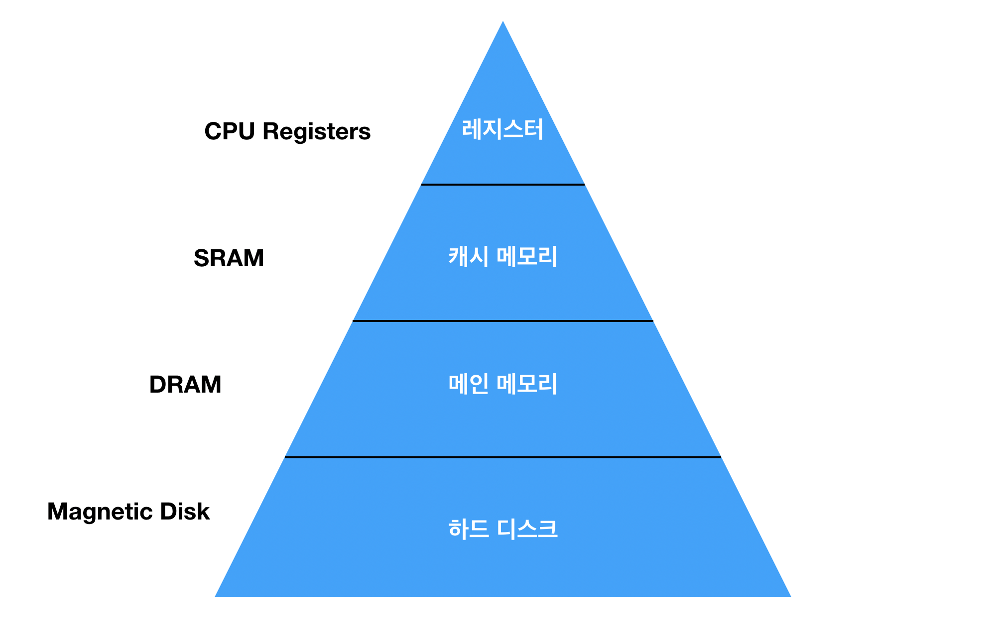
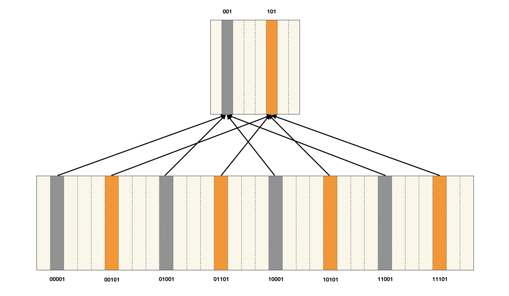

# 캐시 메모리

## 정의

CPU 칩 안에 포함된 작고 빠른 메모리로, 프로그램에서 직접적으로 읽거나 쓸 수 없고 하드웨어의 메모리 관리 시스템이 내부적으로 제어한다.

대부분 프로그램은 한번 사용한 데이터를 다시 사용할 가능성이 높고 그 주변의 데이터도 곧 사용할 가능성이 높은 데이터 지역성을 가지고 있는데, 이러한 지역성을 이용하여 메인 메모리에 있는 데이를 캐시 메모리에 불러와 두고 CPU가 캐시 메모리에서 데이터를 먼저 찾도록 하여 성능을 높였다.

## 배경

CPU의 클럭 속도가 매우 빨라짐에 따라 CPU 밖에 있는 DRAM과의 속도 차이도 자연스레 증가하게 되었는데, 이 격차를 줄이고자 캐시 메모리가 필요하게 되었다.

### 메모리 계층 구조

메모리들은 프로그램이 실행하는 동안 데이터의 입출력을 담당한다. 즉, 실행에 필요한 데이터들을 저장하고 있다.

메모리는 위와 같이 4계층으로 구성되는데 각각의 메모리 속도는 CPU와의 거리 차이에서 난다.

CPU와의 거리가 가까울수록 빠르고 용량이 작으며 멀수록 느리고 용량이 크다.

## 캐시 레벨 (L1, L2, L3)

메모리에도 계층이 있듯이 캐시에도 레벨이 있다.

L1, L2, L3 캐시로 나뉘는데 우리말로 따지자면 1차 캐시, 2차 캐시와 같은 것이다.

속도와 크기에 따라 분류한 것으로 L1 캐시가 가장 작고 빠르며 다음으로 L2, L3 순서이다.

## 작동 원리

CPU가 메모리에 데이터를 요청할 때 우선적으로 캐시를 확인하고, 캐시에 데이터가 없으면 메인 메모리를 확인한다.

이 때, 캐시에 메모리가 있는 것을 **캐시 히트**라고 하며 없는 것을 **캐시 미스**라고 한다.

다음 세 가지 경우에는 캐시 미스가 발생할 수 있다.

- Compulsory miss(또는 cold miss) : 해당 메모리 주소를 처음 불렀기 때문에 나는 미스
- Conflict miss : 캐시 메모리에 A 데이터와 B 데이터를 저장해야 하는데, A와 B가 같은 캐시 메모리 주소에 할당되어서 나는 캐시 미스
- Capacity miss : 캐시 메모리에 공간이 부족해서 나는 캐시 미스

만약 대부분의 메모리 요청이 캐시 미스라면 캐시 메모리를 안 쓰는 게 더 빠르지만 다행히도 캐시 미스 비율이 대체로 평균 10% 안쪽이다.
그러므로 캐시 메모리를 통해 컴퓨터 시스템의 평균 성능을 크게 향상시킬 수 있으며 클럭 속도, 코어 개수와 함께 컴퓨터 성능에서 매우 큰 비중을 차지한다.

## 캐시 구조

- Direct Mapped Cache : 

가장 기본적인 캐시 구조로, DRAM의 여러 주소가 캐시 메모리의 한 주소에 대응되는 다대일 방식이다.
간단하고 빠르지만 대신 약점이 굉장히 큰데, Conflict miss 문제가 굉장히 큰 방식이다.

- Fully Associative Cache : 비어있는 캐시메모리가 있으면 그냥 마음대로 주소를 저장하는 방식이다.
즉 저장할 때는 크게 알고리즘이 필요없어서 간단한데, 찾을 때가 문제다.
어떠한 조건이나 규칙이 없으니 특정 캐쉬 Set내의 모든 블럭을 한번에 찾아 원하는 데이터가 있는지 검사해야한다.

- Set Associative Cache : Direct Mapping과 Associative를 섞었다고 할 수 있는 방식이다.
특정 행을 지정해서 그 행안의 어떤 열이든 비어있으면 저장하는 방식이다.
당연히 Direct에 비해서는 검색은 오래 걸리지만 저장이 빠르며 Associative에 비해 저장이 느린 대신 검색이 빠른, 중간 형이라고 할 수 있다.

### 캐시 교체 정책 (Cache's Replacement Policy) 

프로그램이 실행되는 동안 빠른 데이터 전송을 위해 모든 메모리는 항상 채워져 있다.

하지만 메모리가 가지고 있지 않은 데이터를 요구한다면? 메모리 블록을 교체해서 오래된 데이터를 지워야한다.

대표적인 블록 교체 알고리즘으로는 **LRU(Lease-Recently Used) 알고리즘**으로 가장 오래전에 참조된 블럭을 밀어낸다.

### 캐시와 버퍼의 차이점

**버퍼 캐시**란 보조기억장치로서, 특히 디스크의 입출력 효율을 높이기 위해 주기억 장치의 한 영역을 최근에 사용된 디스크 블록의 내용을 기억하는 버퍼영역으로 할당한 것을 말하는데, 버퍼캐시에 있는 디스크 블록은 디스크 액세스 없이 바로 이용할 수 있으므로 효율이 높아진다. 

버퍼는 역시 두 장치 속도가 차이가 날때 사용하지만, 보통 속도 향상을 위한 것이 아니라 빠른쪽에서 데이터가 느린쪽으로 보내질때 데이터의 손실을 막기 위해서 쓰인다.

*데이터의 중간 저장소*라는 측면에서 버퍼는 캐시와 마찬가지이지만, 캐시가 어떤 작업의 속도를 증진시키기 위해 존재하는데 비해 버퍼는 개별 작업들 간의 협동을 지원하기 위해 존재한다는 차이가 있다고 볼 수 있다.

# References

- [나무위키](https://namu.wiki/w/%EC%BA%90%EC%8B%9C%20%EB%A9%94%EB%AA%A8%EB%A6%AC)
- [hacker dakuo](https://dakuo.tistory.com/126)
- [Ryu's story](https://ryusstory.tistory.com/entry/Cache-Buffer-%EC%BA%90%EC%89%AC%EC%99%80-%EB%B2%84%ED%8D%BC)
