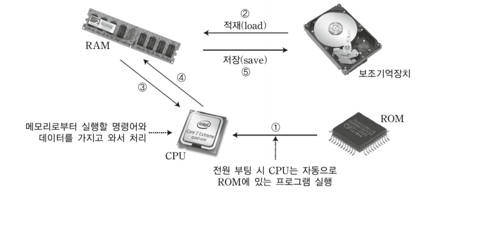
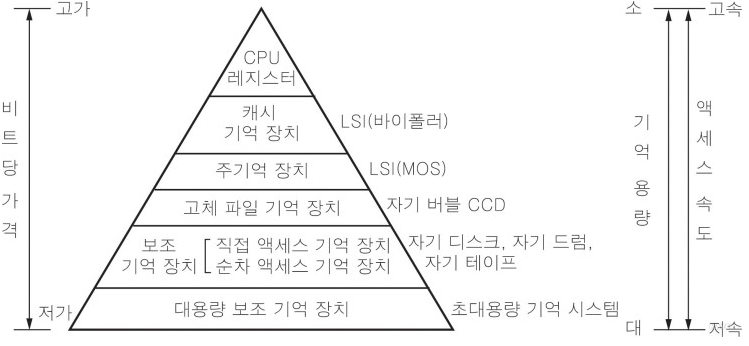

# 보조기억장치  

## 보조기억장치란?    

CPU(중앙처리장치) 외부에 존재하며, 주기억장치의 용량을 보조하기 위해 사용하는 것이다.  
주기억장치의 단점을 보완하기 위해 등장하였다.    

## 특징  

- 주기억장치에 비해 속도가 느리다. 약 1000배 정도  
- CPU와 직접 자료 교환 불가 -> CPU는 주기억장치와 교환가능 ==> 그러므로 접근시간이 오래걸린다.  
- 전원이 차단되어도 내용이 유지된다.  
- 저장용량이 크다.  
- 주기억장치보다 싸다.  

  

  

## 종류  
- 하드디스크  
- 자기디스크  
- 자기테이프  
- 광디스크  
- RAID  
- 플래시기억장치  

