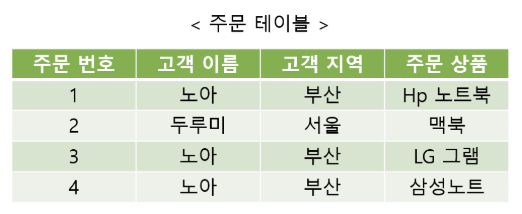
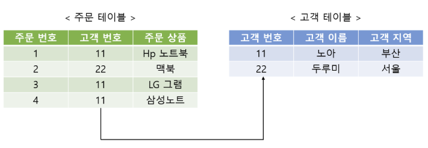

# RDB(Relational Database)   관계형 데이터베이스

 ### 관계형 데이터 모델에 기초를 둔 데이터베이스
 
 
 관계형 데이터 모델이란?
   - 데이터 구성의 한 방법으로, 모든 데이터를 2차원 테이블 형태로 표현하는 것, 데이터 간의 상관관계를 개체간의 관계로 표현한 것
  
 ### 관계형 데이터베이스란?
  1970년대 E.F Codd가 제안한 데이터베이스 모델이며 데이터를 테이블 형태로 저장한다. 각 데이터 항목들은 행(row)에 저장되고, 항목의 속성은 열(column)이라고 표현한다. 컬럼을 통해 입력되는 데이터의 유형이 정해진다
  
 
 
* 테이블(table) : 데이터를 체계화하여 행과 열의 형태로 구성한 것으로 테이블 이름을 붙인다.
* 열(column) : 필드(field) 라고도 부르며, 항목의 속성(명칭)을 나타낸다.  필드 마다 각각 정수, 텍스트 같은 데이터 유형을 정할 수 있다. 
* 행(row) : 레코드(record) 라고도 부르며, 각 데이터 항목을 저장한다. 
* 스키마(schema) : 필드는 데이터 유형뿐만 아니라 제약사항도 지정할 수 있는데 이러한 제약사항을 스키마라고 부른다. 예를들어 필드는 중복 값을 해당 행에 저장할 수 없다거나, 반드시 값을 가져야 한다(not null)는 조건 등을 걸 수 있다.
* 키(key) : 레코드를 구성하는 필드에서 각 레코드를 구분할 수 있는 필드 값을 뜻한다.

 ### 관계형 데이터베이스에서의 관계
 
 테이블 간의 관계는 일 대 일(1:1), 일 대 다(1:N), 다 대 다(N:N) 의 관계가 있다.

하나의 테이블에 필요한 모든 필드를 넣고 모든 데이터 항목을 저장할 수 있다. 하지만 이렇게하면 데이터들이 중복해서 저장되는 상황이 발생할 수 있어  비효율적이다. 

 

그림과 같이 고객의 상품 주문을 저장하는 테이블이 있다고 가정하면 특정 고객이 여러 상품을 구매하는 경우 고객 이름과 고객 지역 데이터가 계속 해서 중복된다.
관계형 데이터베이스 모델에서는 다음 그림과 같이 테이블을 분리하여 행과 행을 연결할 수 있다.

 

그림과 같이 테이블 간의 관계는 기본 키(primary key) 와 외래 키(foreign key) 라는 개념을 사용하여 맺어질 수 있다.
기본 키는 고유한 ID 필드로 그림에서는 고객 번호 필드이다. 이 필드는 각 행이 중복된 값을 가질 수 없다.
외래 키는 기본 키를 참조하는 필드로 그림에서는 주문 테이블의 고객 번호 필드이고 각 테이블의 행을 연결시켜주는 역할을 한다.
이렇게 테이블을 분리하고 관계를 형성해 데이터를 효율적으로 관리할 수 있다.
( 테이블을 분리하고 중복 데이터를 제거하는 과정을 정규화 라고 한다.)

RDB는 데이터의 독립성이 높고 고수준의 DML(데이터 조작언어)을 사용하여 결합,제약,투영 등의 관계 조작에 의해 표현능력을 높일 수 있다.
이들의 관계 조작에 의해 자유롭게 구조를 변경할 수 있다는 것이 RDB의 특징이다.
### RDB의 종류
1. Oracle
2. My SQL
3. DB2
4. Microsoft SQL Server
5. informix
등등

### RDBMS(Relational Database Management System)
관계형 데이터베이스를 생성하고 수정하고 관리할 수 있는 소프트웨어
  #### SQL
   관계형 데이터베이스에서 주요한 특징 중 하나는 SQL이라는 구조화 질의어를 사용한다는 것이다. SQL은 RDBMS에서 사용하는 프로그래밍 언어라고 보면 된다. SQL을 통해 RDBMS에서 데이터를 검색하고, 추가하고, 업데이트하고, 삭제하는 작업 등 데이터를 관리한다.
SQL의 종류로는 데이터 정의 언어, 데이터 조작 언어, 데이터 제어 언어가 있다.

  #### 트랜잭션
   트랜잭션은 데이터베이스 관리시스템(DBMS)에서 하나의 작업의 단위이다.
데이터베이스는 여러 사람들이 데이터를 공유하고 사용할 목적으로 사용된다. 그렇기 때문에 다수의 사람들이 동시에 사용하더라도 데이터에 문제가 없어야한다. 트랜잭션은 모든 명령문을 완벽하게 처리하거나, 하나의 명령문이라도 문제가 발생하면 모든 명령문을 수행하지 않고 데이터를 보존하는 기능을 하고 해야한다.

 - 원자성 (Atomicity) : 원자성이란 트랜잭션이 수행하는 연산들을 모두 정상적으로 처리하거나 모두 처리하지 않아야 한다는 all-or-nothing 방식을 의미한다. 

 - 일관성 (Consistency) : 일관성은 트랜잭션이 성공적으로 수행된 이후에도 데이터베이스의 데이터는 일관된 상태를 유지해야 한다는 의미이다.

 - 격리성 (Isolation) : 격리성은 하나의 트랜잭션이 완료될 때까지 다른 트랜잭션이 간섭하지 못하도록 하여 각각의 트랜잭션이 독립적으로 수행되어야 한다는 의미이다.

 - 지속성 (Durability) : 지속성은 트랜잭션이 성공적으로 완료된 이후에 데이터베이스의 데이터들이 영구적으로 보존되어야 한다는 의미이다. 

