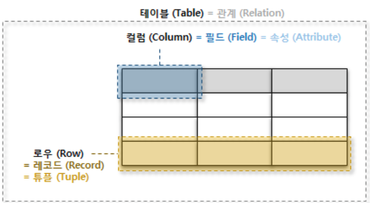

# RDB(Relational Database)   관계형 데이터베이스

 ### 관계형 데이터 모델에 기초를 둔 데이터베이스
 
 
 관계형 데이터 모델이란?
   - 데이터 구성의 한 방법으로, 모든 데이터를 2차원 테이블 형태로 표현하는 것, 데이터 간의 상관관계를 개체간의 관계로 표현한 것
  
 ### 관계형 데이터베이스란?
  1970년대 E.F Codd가 제안한 데이터베이스 모델이며 데이터를 테이블 형태로 저장한다. 각 데이터 항목들은 행(row)에 저장되고, 항목의 속성은 열(column)이라고 표현한다. 컬럼을 통해 입력되는 데이터의 유형이 정해진다
  
 
 
* 테이블(table) : 데이터를 체계화하여 행과 열의 형태로 구성한 것으로 테이블 이름을 붙인다.
* 열(column) : 필드(field) 라고도 부르며, 항목의 속성(명칭)을 나타낸다.  필드 마다 각각 정수, 텍스트 같은 데이터 유형을 정할 수 있다. 
* 행(row) : 레코드(record) 라고도 부르며, 각 데이터 항목을 저장한다. 
* 스키마(schema) : 필드는 데이터 유형뿐만 아니라 제약사항도 지정할 수 있는데 이러한 제약사항을 스키마라고 부른다. 예를들어 필드는 중복 값을 해당 행에 저장할 수 없다거나, 반드시 값을 가져야 한다(not null)는 조건 등을 걸 수 있다.
* 키(key) : 레코드를 구성하는 필드에서 각 레코드를 구분할 수 있는 필드 값을 뜻한다.

 ### 관계형 데이터베이스에서의 관계
 
 
 
 
 
RDB는 데이터의 독립성이 높고 고수준의 DML(데이터 조작언어)을 사용하여 결합,제약,투영 등의 관계 조작에 의해 표현능력을 높일 수 있다.
이들의 관계 조작에 의해 자유롭게 구조를 변경할 수 있다는 것이 RDB의 특징이다.

### RDB의 종류

### RDBMS(Relational Database Management System)
관계형 데이터베이스를 생성하고 수정하고 관리할 수 있는 소프트웨어
  
 
 
