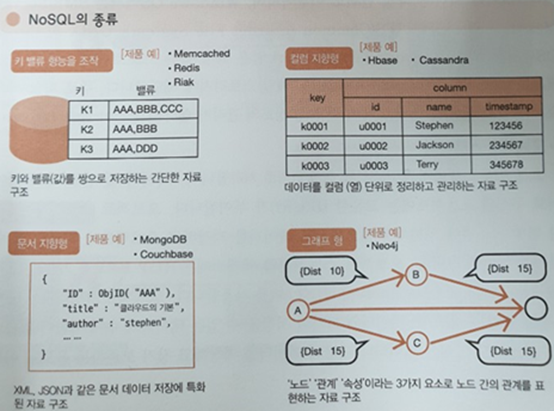

# NoSQL

먼저, SQL이란 관계형 DBMS에서 데이터를 조회, 수정, 삭제하거나, DBMS를 조작하는데 사용되는 언어인데, 앞에 "No"가 붙은 NoSQL!!!! 과연 무엇일까요?!!!

## 어디에나 있지만, 나는 모르는 NoSQL

평소에  Facebook, Netflix, Instagram, Apple의 iCloud, 삼성의 SCloud 등의 서비스를  사용한다면 이미 NoSQL DB기술을 활용하고 있는 것!

또한, 사이트들에 우리가 올린 사진이나, 메시지들을 저장할때, 많은 분들이 동시에 웹 쇼핑몰에 접속했을 때, 선호하시는 상품을 실시간으로 추천해 줄 때, 거의 예외 없이 사용되는 기술이 바로 NoSQL DB기술이다. 이렇게 다양한 환경에서 활용하는 DBMS의 종류 중 하나인 NoSQL에 대해서 설명을 이어가보도록 하겠다.

## NoSQL이 어디서 왔는가?

 NoSQL이 무엇의 약자인지는 사람에 따라 No SQL, Not Only SQL, Non-Relational Operational Database SQL로 엇갈리는 의견들이 있지만, 현재 **Not Only SQL**로 풀어 설명하는 것이 다수를 차지하고 있다.

이 말의 의미를 풀어보면, 단순히 기존 관계형 DBMS가 갖고 있는 특성뿐만 아니라, **다른 특성들을 부가적으로 지원한다는 것을 의미한다.**

이 용어가 처음으로 등장한 것은 1998년 카를로 스트로찌(Carlo Strozzi)라는 엔지니어가 공개한 표준 SQL 인터페이스를 채용하지 않은 자신의 경량 Open Source 관계형 데이터베이스를 NoSQL이라고 명명한데서 유래했다고 한다.

이후 2009년에는 요한 오스칼손(Johan Oskarsson)이라는 엔지니어가 Open Source기반의 분산 데이터베이스 관련 행사를 준비하면서 NoSQL이라는 용어를 사용했고, 이때부터 기존의 관계형 데이터베이스 시스템의 주요 특성을 보장하는 ACID(Atomic, Consistency, Integrity, Durability) 특성을 제공하지 않는, 그렇지만 뛰어난 확장성이나 성능 등의 특성을 갖는 수많은 비관계형, 분산 데이터 베이스들이 등장하였고, NoSQL이라는 용어가 보편적으로 사용되었다.

NoSQL이 등장한 이후에도 시장에서는 관계형 데이터베이스가 데이터를 처리하는데 가장 최적의 시스템으로 받아들이고 있었습니다. 특히 기업의 ERP나, MIS 시스템 등 데이터의 정확한 처리가 필수적인 시스템에서는 현재도 관계형 데이터베이스를 사용하고 있습니다. 또한 무엇보다도 SQL 이라고 하는 데이터를 처리하는 언어의 편이성 때문에 NoSQL 등 다른 데이터베이스 시스템들은 많이 활용 되지 않고 있었습니다.

그러나, 2000년 후반으로 넘어오면서 인터넷이 활성화되고, 소셜네트워크 서비스 등이 등장하면서 관계형 데이터 또는 정형데이터가 아닌 데이터, 즉 **비정형데이터라는 것을 보다 쉽게 담아서 저장하고 처리할 수 있는 구조를 가진 데이터 베이스들이 관심**을 받게 되었고, 해당 기술이 점점 더 발전하게 되면서, NoSQL 데이터베이스가 각광을 받게 된 것입니다.

*여기서 비정형 데이터란 형태가 없으며, 연산도 불가능한 데이터로 예를 들면 소셜데이터(트위치, 페이스북), 영상, 이미지, 음성, 텍스트(word, PDF...) 등을 말한다.* 

이러한 배경하에서 어떤 엔지니어들은 NoSQL을 Modern web-scale databases라고 정의하기도 합니다.NoSQL 데이터베이스의 특징을 살펴보면, 기존의 관계형 데이터베이스 보다 더 융통성 있는 데이터 모델을 사용하고, 데이터의 저장 및 검색을 위한 특화된 매커니즘을 제공합니다.이를 통해 **NoSQL 데이터베이스는 단순 검색 및 추가 작업에 있어서 매우 최적화된 키 값 저장 기법을 사용하여, 응답속도나, 처리 효율 등에 있어서 매우 뛰어난 성능을 나타냅니다.** 

## NoSQL 이란

> 대용량 웹 서비스를 위하여 만들어진 데이터 저장소

> 관계형 데이터 모델을 지양하며 대량의 분산된 데이터를 저장하고 조회하는 데 특화된 저장소

> 스키마 없이 사용 가능하거나 느슨한 스키마를 제공하는 저장소

## NoSQL 장점

- NoSQL은 RDBMS와는 달리 데이터 간의 관계를 정의하지 않는다.

가장 큰 특징 중의 하나는 관계형 데이터베이스인 RDBMS가 데이터의 관계를 Foreign Key 등으로 정의하고 이를 이용해 Join 등의 관계형 연산을 한다고 하면, NoSQL은 데이터 간의 관계를 정의하지 않는다. 데이터 테이블은 그냥 하나의 테이블이며 각 테이블 간의 관계를 정의하지도 않고 일반적으로 테이블 간의 Join도 불가능하다

- RDBMS에 비해 훨씬 더 대용량의 데이터를 저장할 수 있다.

RDBMS의 복잡도와 용량 한계를 극복하기 위한 목적으로 등장한 만큼, 페타바이트급의 대용량 데이터를 저장할 수 있다.

- 분산형 구조

NoSQL은 기존의 RDBMS와는 다르게 하나의 고성능 머신에 데이터를 저장하는 것이 아니라, 일반적인 서버(인텔 계열의 CPU를 사용하는 Commodity Server) 수십 대를 연결해 데이터를 저장 및 처리하는 구조를 갖는다. 즉 분산형 구조를 통해 데이터를 여러 대의 서버에 분산해 저장하고, 분산 시에 데이터를 상호 복제해 특정 서버에 장애가 발생했을 때에도 데이터 유실이나 서비스 중지가 없는 형태의 구조다.

- 고정되지 않은 테이블 스키마

## 기존 관계형 DB와 차이점

- 관계형 모델을 사용하지 않으며 테이블간의 조인 기능 없음
- 직접 프로그래밍을 하는 등의 비SQL 인터페이스를 통한 데이터 액세스
- 대부분 여러 대의 데이터베이스 서버를 묶어서(클러스터링) 하나의 데이터베이스를 구성- 관계형 데이터베이스에서는 지원하는 Data처리 완결성(Transaction ACID 지원) 미보장
- 데이터의 스키마와 속성들을 다양하게 수용 및 동적 정의 (Schema-less)- 데이터베이스의 중단 없는 서비스와 자동 복구 기능지원
- 다수가 Open Source로 제공- 확장성, 가용성, 높은 성능

정리해보면, NoSQL은 초고용량 데이터 처리 등 성능에 특화된 목적을 위해, 비관계형 데이터 저장소에, 비구조적인 데이터를 저장하기 위한 분산 저장 시스템이라고 볼 수 있다.

## 저장 방식에 따른 NoSQL 분류

Key-Value Model, Document Model, Column Model, Graph Model로 분류할 수 있다.

> Key-Value Model

가장 기본적인 형태의 NoSQL이며 키 하나로 데이터 하나를 저장하고 조회할 수 있는 단일 **키-값 구조**를 갖는다. 단순한 저장구조로 인하여 복잡한 조회 연산을 지원하지 않는다. 또한 **고속 읽기와 쓰기에 최적화**된 경우가 많다. 사용자의 프로필 정보, 웹 서버 클러스터를 위한 세션 정보, 장바구니 정보, URL 단축 정보 저장 등에 사용한다. 하나의 서비스 요청에 다수의 데이터 조회 및 수정 연산이 발생하면 트랜잭션 처리가 불가능하여 데이터 정합성을 보장할 수 없다.

ex) Redis

> Document Model

키-값 모델을 개념적으로 확장한 구조로 **하나의 키에 하나의 구조화된 문서를 저장하고 조회**한다. 논리적인 데이터 저장과 조회 방법이 관계형 데이터베이스와 유사하다. 키는 문서에 대한 ID로 표현된다. 또한 저장된 문서를 컬렉션으로 관리하며 문서 저장과 동시에 문서 ID에 대한 **인덱스를 생성**한다. 문서 ID에 대한 인덱스를 사용하여 O(1) 시간 안에 문서를 조회할 수 있다. 대부분의 문서 모델 NoSQL은 B트리 인덱스를 사용하여 2차 인덱스를 생성한다. B트리는 크기가 커지면 커질수록 새로운 데이터를 입력하거나 삭제할 때 성능이 떨어지게 된다. 그렇기 때문에 읽기와 쓰기의 비율이 7:3 정도일 때 가장 좋은 성능을 보인다. 중앙 집중식 로그 저장, 타임라인 저장, 통계 정보 저장 등에 사용된다.

ex) MongoDB

> Column Model

**하나의 키에 여러 개의 컬럼 이름과 컬럼 값의 쌍으로 이루어진 데이터를 저장하고 조회**한다. 모든 컬럼은 항상 타임 스탬프 값과 함께 저장된다.

구글의 **빅테이블**이 대표적인 예로 차후 컬럼형 NoSQL은 빅테이블의 영향을 받았다. 이러한 이유로 Row key, Column Key, Column Family 같은 빅테이블 개념이 공통적으로 사용된다. 저장의 기본 단위는 컬럼으로 컬럼은 컬럼 이름과 컬럼 값, 타임스탬프로 구성된다. 이러한 컬럼들의 집하빙 로우(Row)이며, 로우키(Row key)는 각 로우를 유일하게 식별하는 값이다. 이러한 로우들의 집합은 키 스페이스(Key Space)가 된다.

대부분의 컬럼 모델 NoSQL은 쓰기와 읽기 중에 쓰기에 더 특화되어 있다. 데이터를 먼저 커밋로그와 메모리에 저장한 후 응답하기 때문에 빠른 응답속도를 제공한다. 그렇기 때문에 읽기 연산 대비 쓰기 연산이 많은 서비스나 빠른 시간 안에 대량의 데이터를 입력하고 조회하는 서비스를 구현할 때 가장 좋은 성능을 보인다. 채팅 내용 저장, 실시간 분석을 위한 데이터 저장소 등의 서비스 구현에 적합하다.

ex) Google Big Table, Cassandra

 