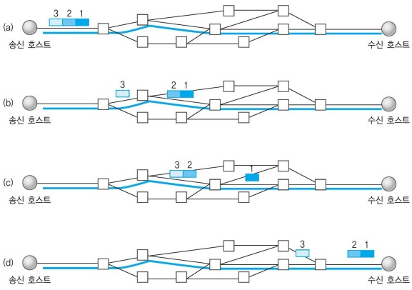
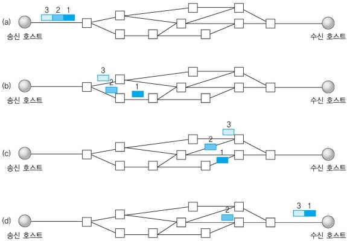

# 컴퓨터 네트워크 데이터 교환 방식

 
 네트워크란?
 
  [네트워크 데이터 전송 방식](https://github.com/RealCrewOnDev/gaenyeom-baksal/blob/master/network/data_transmission_mode.md).

## 교환방식

 경로를 올바르게 선정하기위해 교환시스템의 교환기능을 사용한다.
 교환 시스템에는 크게 __회선 교환 방식__ 과 __패킷 교환 방식__ 이 존재하고 이외에 셀 릴레이와 프레임 릴레이가 존재한다.
 
 
 
### 회선 교환 방식
 
 고정 대역을 할당된 연결을 설정하여 데이터 전송 
 
 다른 말로 하자면 데이터가 전송될 때 지나가는 길이 정해져 있는 것이다. 이렇게 되면 안정적인 전송률을 가질 수 있고 라우팅의 작업이 쉽다. 논리적인 전송 선로를 전용으로 할당받아 모든 데이터가 같은 경로로 전달된다.

### 패킷 교환 방식
 
 패킷이라는 일정 크기로 나누어 전송하며 각 패킷은 독립적으로 라우팅 과정을 거쳐 목적지에 도달하는 방식. __가상 회선 방식__ 과 __데이터그램 방식__ 으로 나뉜다.
 
 - 가상 회선 방식 : 데이터를 패킷 단위로 나누어 전송하지만 송수신 호스트 사이에 가상 연결을 설정하므로 모든 패킷의 전달 경로가 동일하다.
 회선 교환 방식과 비슷해 보이나 패킷을 통해 움직인다는 다른 점이 있다.

 - 데이터그램 방식 : 경로 선택이 독립적으로 이루어진다. 패킷 자체를 완전 독립적으로 전송하므로 양이 적거나 신뢰성이 중요하지 않은 환경에서 사용된다. 왜냐하면 미리 경로를 할당 받지 않기 때문에 데이터들의 도착 순서가 바뀌는 경우가 많이 발생하기 때문이다.

 

#### 패킷 교환의 장점

∙전송 대역의 효율적 이용

전송한 패킷들이 동적인 방식으로 전송 대역을 공유하기 때문에 전송 선로의 이용 효율을 극대화 할 수 있다. 쉽게 말하자면 막힌 길과 뚫린 길을 읽을 수 있어 데이터를 조금 더 효율적으로 보낼 수 있다는 것이다.

∙호스트의 무제한 수용

회선 교환 방식은 모든 회선 연결에 할당된 대역의 합이 전체 네트워크 전송 용량을 초과할 수 없다. 그러나 패킷 교환 방식은 전송 대역이 부족해 연결 설정 요청을 수용하지 못하는 경우가 없다. 하지만 호스트가 늘어나면 네트워크가 혼잡해져 전송 지연이 심화된다.

∙패킷에 우선순위 부여

패킷이라는 단위로 데이터가 움직이기 때문에 우선순위를 부여하여 패킷을 따로 처리할 수 있다.

패킷 교환 방식은 개발된 시점에 많은 오류를 생성하였다. 따라서 오류를 처리하기 위해 오버헤드 비트를 추가를 많이 하여 오류를 해결하였다. 하지만 현대에 와서는 물리적인 전송 오류가 발생할 확률이 낮다. 따라서 오류 제어를 위해 필요한 환경을 전송 속도를 높여주는 방향으로 개선한 방식이 프레임 릴레이와 셀 릴레이 방식이다.

### 프레임 릴레이
프레임 릴레이는 동일한 속도의 전송 매체로 고속 데이터 전송을 지원할 수 있도록 고안된 기술이다. 각 라우터의 개별 연결을 의미하는 홉단위의 흐름 제어와 오류 제어 기능을 수행하지 않는다. 쉽게 말하면 원래는 각 중간 노드를 지나칠 때마다 데이터 수신에 대한 응답을 보내야 하는데 이 과정을 무시하고 전체 큰 단위의 응답만 수행하여 응답을 처리하는데 들이는 시간을 줄이는 것이다.

### 셀 릴레이
셀 릴레이는 ATM(Asynchronous Transfer Mode)라고도 불리는데 셀이라는 고정 크기의 패킷을 사용한다. 고정된 크기의 패킷을 사용하면 가변적일 때 보다 오버헤드를 줄일 수 있어 전송률이 빨라진다.
