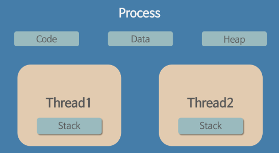

# 프로세스와 스레드(2탄)  

### 스레드(Thread) 란?  
- 프로세스 내에서 실행되는 흐름의 단위  
- 일반적으로 한 프로세스는 하나의 스레드를 가지고 있지만, 
환경에 따라 둘 이상의 스레드를 동시에 실행할 수 있다. ==> 멀티스레드  

### 스레드의 특징  

  

- 스레드는 프로세스 내에서 각각 stack만 할당받고, code, data, heap 영역을 공유한다.  
- 메모리를 공유하므로 데이터 주고받음이 간단하다.  
- 응답시간 단축되고, 자원소모가 줄어든다.  
- context switching의 오버헤드 문제 해결  
- 멀티스레드의 경우 어떤 스레드가 먼저 실행될지 순서를 알 수 없다.  

  

### 스레드의 종류  

**스레드를 지원하는 주체에 따라 2가지로 나뉜다.**  

- 사용자 레벨 스레드(User-Level Thread)  
> 커널 영역의 상위에서 지원, 사용자 레벨 라이브러리를 통해 구현  
> 라이브러리가 스레드의 생성 및 스케줄링등을 관리  
> 동일한 메모리 영역에서 스레드가 생성 및 관리되므로 속도가 빠름  
> 단, 여러 개의 사용자 스레드 중 하나의 스레드가 시스템 호출등으로 중단되면  
> 나머지 스레드 역시 중단됨  
> 왜냐하면 커널이 프로세스 내부의 스레드를 인식하지 못하여  
> 해당 프로세스를 대기 상태로 전환시키기 때문이다.  

- 커널 레벨 스레드(Kernel-Level Thread)  
> 운영체제가 지원  
> 커널이 스레드의 생성 및 스케줄링 등을 관리  
> 스레드가 시스템 호출등으로 중단되더라도 커널은 프로세스 내의 다른 스레드를 중단시키지 않음  
> 다중처리기 환경에서 커널은 여러 개의 스레드를 각각 다른 처리기에 할당 가능  
> 사용자 스레드에 비해 생성 및 관리하는 것이 느림  

### 프로세스와 스레드 비교  

- 멀티프로세스와 멀티스레드는 둘다 여러흐름이 동시에 진행된다.  
- 멀티프로세스는 각 프로세스 독립적으로 실행 -> 별개의 메모리 차지  
- 멀티스레드는 프로세스 내의 메모리를 공유  
- 프로세스간의 전환속도보다 스레드 간의 전환속도가 더 빠르다.  

### 자바 스레드(Java Thread) 란?  

- 일반 스레드와 유사하며, JVM이 운영체제의 역할을 한다.  
- 자바에는 프로세스가 존재하지 않고 스레드만 존재한다.  
- 자바에서 스레드 스케줄링은 JVM에 의해 이루어진다.  
- 즉, 자바 개발자는 자바 스레드로 작동할 스레드 코드를 작성하고,  
  스레드 코드가 생명을 가지고 실행을 시작하도록 JVM에 요청하는 일 뿐이다.  
  
### 스레드 세이프(Thread Safe)란?  

- 멀티스레드 프로그래밍에서 일반적으로 어떤 함수나 변수, 혹은 객체가  
  여러 스레드로부터 동시에 접근이 이루어져도 프로그램의 실행에 문제가 없음을 뜻한다.  
  
### References  

https://gmlwjd9405.github.io/2018/09/14/process-vs-thread.html  
https://magi82.github.io/process-thread/  
https://jojoldu.tistory.com/118  
https://www.crocus.co.kr/1255  
  

