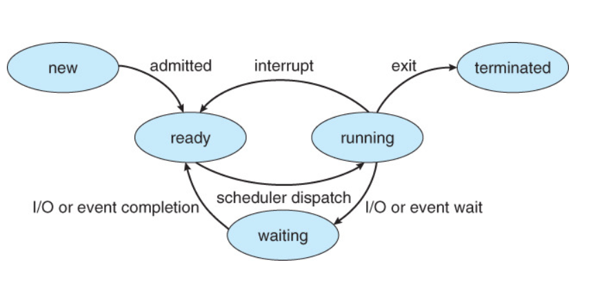
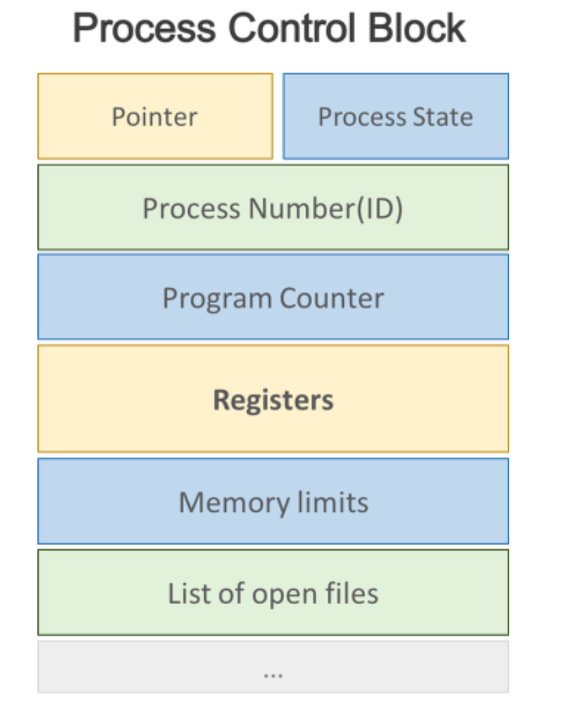

# 프로세스와 스레드  

## 프로세스란?  

- 컴퓨터에서 연속적으로 실행되고 있는 컴퓨터 프로그램  
- 프로그램이 구동이 되어, 주메모리에 적재되면, 메모리 상에서 실행되는 작업의 단위  
- `작업` 이라고도 부른다. (작업관리자에 들어가면 프로세스라고 써있는걸 볼 수 있음!)  

## 프로세스 특징  

- 하나의 프로세서(CPU)는 한 순간 하나의 프로세스만 실행할 수 있다!  
> 그런데 컴퓨터를 쓰다보면 우리는 여러개의 프로세스를 동시에 실행한다.  
> 음악을 들으며~ 문서작업하다가~ 카카오톡도 하고~ 어떻게 동시에 가능할까?  
==> 하나의 프로세서가 빠르게 프로세스들을 왔다리 갔다리 하는 것이다! --> 이것이 바로 멀티태스킹!  

- 하나의 작업을 여러개의 프로세서(CPU)가 하는 것!(듀얼코어..쿼드코어..등등) --> 이것은 멀티프로세싱!  

## 프로세스 생명주기(LifeCycle)  

  

- 생성(new)  
- 준비(ready)    
- 실행
- 대기(waiting)  
- 종료(terminated)  

## 프로세스 제어블록(PCB)  

-프로세스 제어블록이란?  

커널의 자료구조이다.  
프로세스의 정보를 포함하고 있다.  
모든 프로세스는 고유한 PCB를 갖는다.  
프로세스 생성 시 만들어지고, 프로세스가 종료되면 삭제된다.  
프로세스의 중요 정보를 포함하고 있기 때문에, 일반 사용자가 접근하지 못하도록 보호된 메모리 영역에 있다.  

- PCB 포함정보  
   
 
 

  

