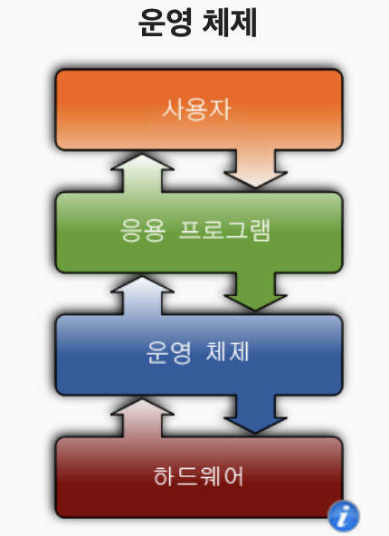
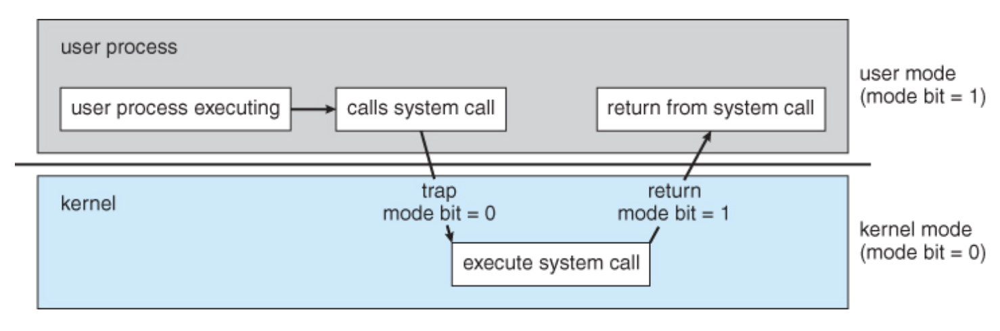

# 운영 체제

## 정의

시스템 하드웨어를 관리할 뿐 아니라 응용 소프트웨어를 실행하기 위하여 하드웨어 추상화 플랫폼과 공통 시스템 서비스를 제공하는 시스템 소프트웨어이다.

최근에는 가상화 기술의 발전에 힘입어 실제 하드웨어가 아닌 하이퍼바이저 위에서 실행되기도 한다.

## 종류

- Single Tasking / Multi Tasking
- 단일 사용자 운영 체제 / 다중 사용자 운영 체제
- 분산 운영 체제
- 판형 운영 체제
- 임베디드 운영 체제
- 실시간 운영 체제
- ...

## 목적

- 사용자에게 컴퓨터와 프로그램을 쉽고 효율적으로 실행할 수 있는 환경 제공
- 컴퓨터 시스템 하드웨어 및 소프트웨어 자원을 여러 사용자 간에 효율적 할당, 관리, 보호하는 것
- 사용자 프로그램의 오류나 잘못된 자원 사용을 감시하는 것과 입출력 장치 등의 자원에 대한 연산과 제어를 관리

## 구성

### Kernel

일반 사용자가 보지 못하는 낮은 수준의 프로세스를 제어함

사용자는 직접적으로 디바이스에 접근하는 simple struct가 불가함

오직 os가 제공하는 system call을 써야만 접근할 수 있음

### User Interface

사용자가 직접 프로그램을 제어하고 사용할 수 있게 하는 기능

아이콘과 바탕화면을 지닌 그래픽이나 명령 줄을 지닌 문자 등

### API

응용 프로그램이 다른 프로그램과 상호 작용할 수 있게 하는 서비스와 코드 라이브러리들

## 프로그램의 실행

운영 체제는 응용 프로그램과 하드웨어 사이의 인터페이스 역할

사용자가 응용 프로그램 실행 → 운영체제가 프로세스를 만듦

(커널은 메모리와 다른 자원을 할당하여 프로세스를 만들며, 멀티태스킹 환경에서 프로세스에 대한 우선 순위를 확립하고 메모리에 프로그램 코드를 적재하며 프로그램 실행)

→ 프로그램은 사용자 및 장치와 상호작용한 다음 원하는 명령 수행

## 예시

- Unix 및 Unix 계열 운영 체제
- macOS
- Linux
- Windows
- ...

# References

- [System structure](https://m.blog.naver.com/PostView.nhn?blogId=x21999&logNo=220763302975&proxyReferer=https%3A%2F%2Fwww.google.com%2F)
- [운영 체제](https://ko.wikipedia.org/wiki/운영_체제#종류)