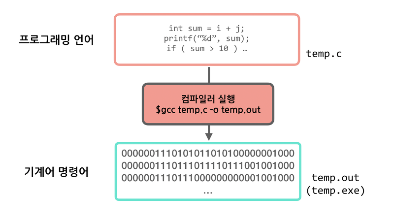
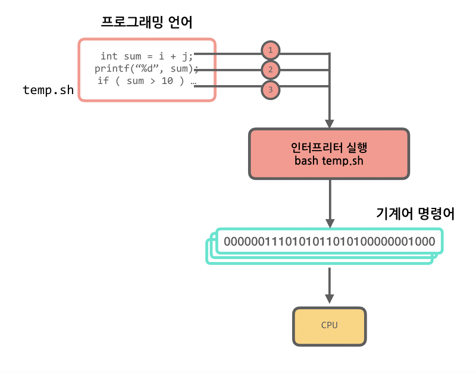

# 컴파일러와 인터프리터
 - 고급언어를 기계언어로 바꾸어 해석하는 프로그램
 - 변환을 런타임(runtime) 전/후 함에 따라 차이가 있음
 
 ### 프로그래밍 언어란?
  컴퓨터 시스템을 구동시키는 소프트웨어를 작성하기 위한 형식언어.  
  고급언어일수록 사람이 사용하는 언어에 가깝다(ex 자바, 파이썬)
  
    
  
## 컴파일러

   사용하는 언어의 문법에 맞게 명령들을 작성하고 파일로 저장하는데 이를 원시파일(소스)라 부른다.
   이 소스는 고급언어이기 때문에 컴퓨터는 이해하지 못한다. (컴퓨터는 0과 1로 이루어진 이진수 기계어만 알아듣기 때문)
   컴퓨터가 이해할 수 있도록 소스를 기계어 코드로 번역하는 동작을 컴파일이라고 하며, 컴파일 작업을 하는 프로그램을 **컴파일러**라고 한다.

   컴파일러는 컴파일 결과로 목적파일(object file) 생성. 목적파일도 바로 실행할수는 없다. 목적파일을 실행파일로 만들어야 실행이 가능하다.
   목적파일을 실행파일로 만드는 동작을 **링크**라고 하고 링크해주는 프로그램을 **링커**라고한다.
   
   소스 파일은 컴파일러에 의해 컴파일되어 목적 파일이 되며 목적 파일은 링커에 의해 링크되어 최종적으로 실행 가능한 실행 파일이 되는데 이 과정을 
   **빌드(Build)** 라고 한다.
   
   
   
   
   
   최근 개발툴들은 자체에 편집기, 컴파일러, 링커를 모두 내장하고 있기 때문에 한 번에 소스를 실행 파일로 바꿀 수 있다.
   디버거, 프로파일러, 리소스 편집기 등 개발에 필요한 편의 기능까지 제공하는 환경을 통합 개발 환경(Integrated Development Environment)라 한다.
   
   런타임 이전에 변환하기 때문에 구동 시간이 오래걸리지만, 구동된 이후는 하나의 패키지로 매우 빠르게 작동하게 된다.
   구동시에 코드와 함께 시스템으로부터 메모리를 할당받으며 할당받은 메모리를 사용하게 된다.
   런타임 이전에 이미 해석을 마치고 대게 컴파일 결과물이 바로 기계어로 전환되기 때문에 OS 및 빌드 환경에 종속적이다.
   그러므로 OS 환경에 맞게 호환되는 라이브러리와 빌드환경을 구분해서 구축해줘야 한다.

   
    
   
## 인터프리터

 
 번역해야할 파일을 받아 코드를 한 줄씩 해석하여 실행하는 **언어처리 프로그램**
 줄 단위로 번역, 실행되기 때문에 시분할 시스템에 유용하며 원시 프로그램의 변화에 대한 반응이 빠르다.
 한 단계씩 테스트와 수정을 하면서 진행시켜 나가는 대화형 언어에 적합하지만, 실행 시간이 길어 속도가 늦다는 단점이 있다.
 프로그램이 직접 실행되므로 목적 파일이 생성되지 않는다.
 
 런타임 이후에 Row 단위로 해석(Interpret) 하며 프로그램을 구동시키는 방식
 대표적인 예로 자바스크립트 같이 스크립팅 언어가 있다.

**컴파일러와 인터프리터의 차이**

 ||컴파일러|인터프리터|
 |:---:|:---:|:---:|
 |번역단위|전체|한줄씩|
 |실행속도|빠름|느림|
 |번역속도|느림|빠름|
 |목적파일|생성|생성x|
 |메모리할당|목적파일 생성시 사용|사용x|
 
 
------------------------------------
참고 

(https://gayris.tistory.com/entry/%EC%BB%B4%ED%8C%8C%EC%9D%BC%EB%9F%AC%EC%9D%98-%EC%A2%85%EB%A5%98%EC%99%80-%EC%97%AD%ED%99%9C)
