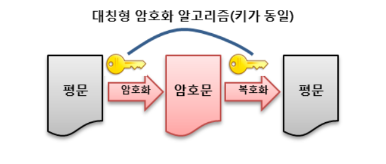
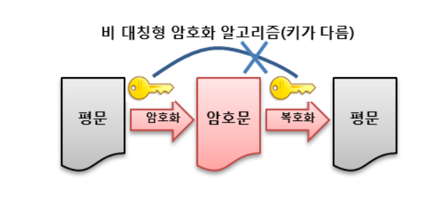
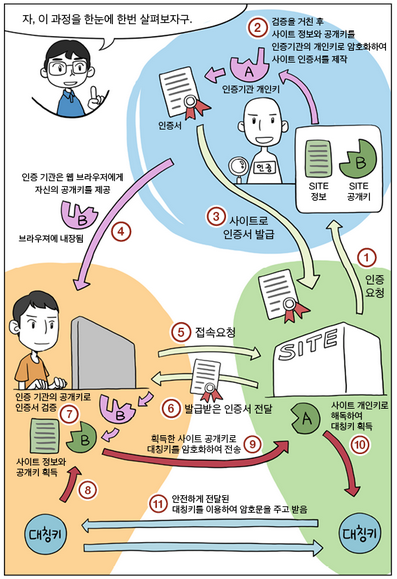

# 공개키와 비밀키 암호화  

### 양방향, 단반향 알고리즘  

**공개키와 비밀키에 앞서 양방향, 단반향 알고리즘을 알아보자**  

- 양방향 알고리즘이란?  
양방향 알고리즘은 암호화된 암호문을 복호화할 수 있는 알고리즘이다.  
공개키와 비밀키 알고리즘이 양방향 알고리즘이다.  

- 단반향 알고리즘이란?  
단반향 알고리즘은 암호화된 암호문을 복호화 할 수 없는 알고리즘이다.  
패스워드의 경우 단반향 알고리즘이 쓰인다. 왜냐하면 암호화된 패스워드가 털려도 복호화할 수 없기 떄문이다.  
**그러면 복호화없이 어떻게 패스워드를 검증할까?**    
동일한 평문은 동일한 암호문으로 암호화된다.  
그러므로 입력받은 값을 암호화하여, 이가 암호화된 패스워드와 비교하여 인증한다.  

### 비밀키 암호화 == 대칭키 == private key  

  

- 암호화, 복호화에 같은 암호키를 사용하는 알고리즘  
- 암호화를 하는 측과 복호화를 하는 측이 같은 암호 키를 공유해야 한다.  
- 암호 키 배송 시 보안에 취약하다.  
- 공개키 암호화에 비해 계산 속도가 빠르다.  
EX) DES, AES  

- 대칭키 암호화는 단위에 따라 스트림 암호화 블록 암호로 나눌 수 있다.  
> 스트림 암호는 연속적인 바이트를 입력받아, 그에 대응하는 암호화 바이트를 생성하는 방식  
> 블록암호는 정해진 블록단위를 입력받아, 그에 대응하는 블록을 생성하는 방식  

### 공개키 암호화 == 비대칭키 == public key  

  

- 암호화, 복호화에 서로 다른 키를 사용하는 암호화 방식  
- 하나의 키는 공개키로 사용한다.  
- 대칭키와 달리 키배송 문제가 존재하지 않는다.  
- 대칭키에 비해 느리다.  
- 중간자 공격을 받을 수 있다.  
EX) RSA, 전자서명  

> 중간자 공격이란?  
> 송신자에게 수신자인척 접근하고, 수신자에게 송신자인척 접근하여, 양쪽의 키를 모두 얻어내는 공격  

### SSL (Secure Socket Layer)  

**현재 공개키 암호화와 대칭키 암호화를 적절히 혼합한 암호화 방식을 사용한다.**  

1. A가 B의 공개키로 암호화 통신에 사용할 대칭키를 암호화하여 B에게 보낸다.  
2. B는 암호문을 받아, 자신의 비밀키로 복호화한다.  
3. B는 A로 부터 얻은 대칭키로 A에게 보낼 평문을 암호화하여 A에게 보낸다.  
4. A는 자신의 대칭키로 암호문을 복호화한다.  
5. 계속 대칭키로 암호화 통신을 한다.  

- SSL 암호화방식은 위와 같은 방식으로 이루어지며,  
통신하는 상대방이 해커인지 아닌지 확인하기 위한 알고리즘이 더해진다.  

1. 사이트는 인증기관에 자신의 정보와 공개키를 제출한다.  
2. 인증기관은 정보를 면밀히 검토 뒤, 사이트의 정보와 공개키를 자신의 비밀키로 암호화한다.  
3. 인증기간완은 인증기관의 비밀키로 암호화한 사이트의 정보와 공개키를 사이트에 송신한다.  
4. 개인이 브라우저를 통해 사이트에 접속하면, 암호화된 사이트의 정보화 공개키를 사이트로부터 받는다.  
5. 브라우저는 인증기관의 공개키(이 공개키는 브라우저에게만 제공)로 이를 복호화하여 사이트의 공개키를 얻는다.  
6. 브라우저가 대칭키를 사이트의 공개키로 암호화하여 사이트에 보낸다.  
7. 사이트는 자신의 개인키로 암호화된 대칭키를 복호화한다.  
8. 이제 개인과 사이트는 대칭키로 통신할 수 있다.  

  

### References  
https://javaplant.tistory.com/26  
https://preamtree.tistory.com/38  
https://12bme.tistory.com/80  

